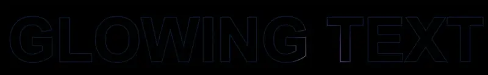

# React Glowing Text

The `GlowingText` component is a React functional component using [framer-motion][motion_url] to create a glowing text effect that reacts to mouse movement like the text "GROK" on x.ai.

<p align="center">

</p>

[![npm][npm_image_url]][npm_url]
[![bundlephobia][bundlephobia_image_url]][bundlephobia_url]

## Features

- Customizable text content and styles
- Animated glowing effect using framer-motion
- Adjustable text stroke width, gradient colors, and animation properties
- Interactive glow that follows the cursor

## Install

```zsh
npm install react-glowing-text

OR

yarn add react-glowing-text

OR

pnpm add react-glowing-text
```

## Props

| Prop Name                | Type             | Default Value                                 | Description                                |
| ------------------------ | ---------------- | --------------------------------------------- | ------------------------------------------ |
| `text` (_required_)      | `string`         |                                               | The text to be displayed.                  |
| `animationProps`         | `AnimationProps` | `undefined`                                   | Animation properties from `framer-motion`. |
| `style`                  | `CSSProperties`  | `undefined`                                   | Custom styles for the outer container.     |
| `textStyle`              | `CSSProperties`  | `undefined`                                   | Custom styles for the text.                |
| `borderColorStyle`       | `string`         | `"linear-gradient(180deg, #6f7374, #0f1518)"` | Gradient for the static text border.       |
| `motionBorderColorStyle` | `string`         | `"linear-gradient(45deg, red, yellow)"`       | Gradient for the moving glowing effect.    |
| `textStrokeWidth`        | `string`         | `"3px"`                                       | Stroke width of the text.                  |
| `radialGradientSize`     | `string`         | `"60px"`                                      | Size of the radial gradient effect.        |

## Usage

```jsx
<GlowingText
  text="Glowing Text"
  textStyle={{
    fontSize: "12vw",
    lineHeight: "30vw",
    fontWeight: "bold",
  }}
  textStrokeWidth="0.34vw"
  radialGradientSize="6.9vw"
  borderColorStyle="linear-gradient(0deg, #00162C -2.41%, #002041 95.22%)"
  motionBorderColorStyle="linear-gradient(279.69deg, #710DC0 1.72%, #F890FF 33.95%, #2FE929 52.83%, #0987F5 72.8%, #007BFF 93.83%)"
  // Other animation //
  animationProps={{
    initial: { clipPath: "inset(0 100% 0 0)" },
    animate: { clipPath: "inset(0 0% 0 0)" },
    transition: { duration: 2, ease: "easeOut" },
  }}
/>
```

## License

This component is open-source and available under the MIT license.

## Author

GlowingText is developed by Thong Dang. You can contact me at thongdn.it@gmail.com

If you like my project, you can [support me][buy_me_a_coffee_url] or star (like) for it.

<p align="center">
</p>

[//]: # "reference links"
[buy_me_a_coffee_image_url]: https://media.giphy.com/media/hXMGQqJFlIQMOjpsKC/giphy.gif
[buy_me_a_coffee_url]: https://www.buymeacoffee.com/thongdn.it
[npm_image_url]: https://img.shields.io/npm/v/react-glowing-text
[npm_url]: https://www.npmjs.com/package/react-glowing-text
[bundlephobia_image_url]: https://badgen.net/bundlephobia/minzip/react-glowing-text
[bundlephobia_url]: https://bundlephobia.com/result?p=react-glowing-text
[motion_url]: https://github.com/motiondivision/motion#readme
